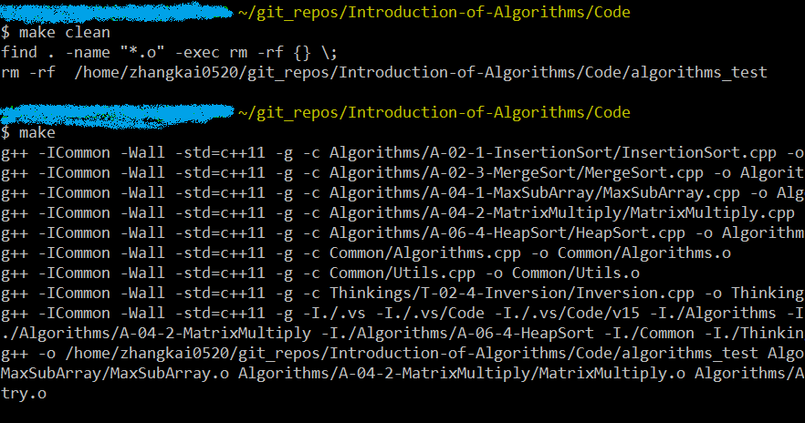

# Introduction-of-Algorithms
Learning &lt;&lt;Introduction of Algorithms>>, and push Algorithms and Practices to server for management and sharing.

## Code
Code include some realization of Algorithms, Practice and Thinking in Book.  
If you have doubt about the realization of Algorithms, Practice and Thinking in Book, you can **referrence** it.  
If you have done the realization, welcome to **Talk and Optimize** it.  
If you want share your realization, welcome your **join**.

### Environment
* Windows
    * [Cygwin](http://www.cygwin.com/) with make and g++
* Unix/Linux
    * make and g++

### Build
* Enter Code directory and execute `make`
* Use `make clean` clean .o fils and binary  
  

### Run
* Execute algorithms_test binary after build successed.
* Select one algorithms/practice/thiking ro run.
* Enter required input, check runing time and running result.  
  

